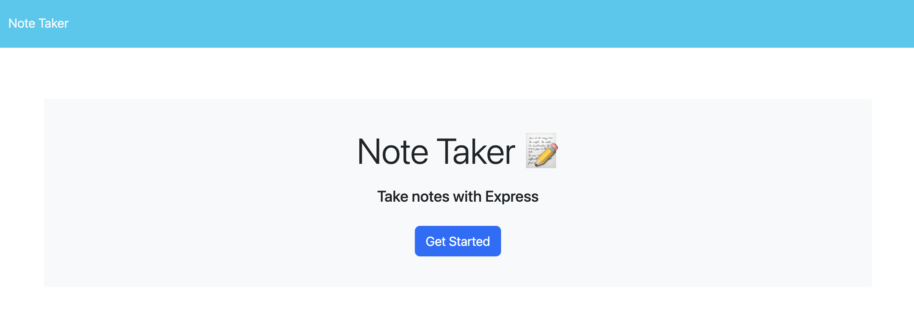
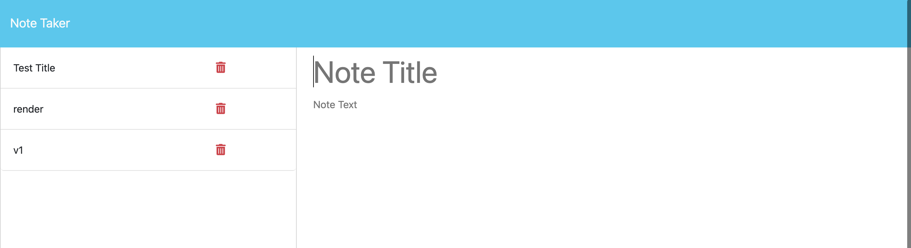
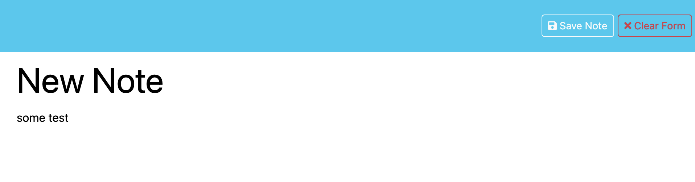

# Backend Note Builder
  
  ## Description:
  The main goal of this project is to create an application that can be used to write and save notes. The application will use an Express.js back end and will save and retrieve note data from a JSON file. The application will be deployed on Heroku. After completion of the project, I have a better understanding	 of building RESTful APIs with Node.js through the Express.js framework.  I also learned how to use API request methods along with their respective routes. And lastly I learned some better ways to refactor and format the code, making it easier to read and modify.  For instance, instead of having the then() method on the same line as the function, all then/catch methods independently have their own line.
  
  ## Table of Contents:
  - [Installation Instructions](#Installation-Instructions)
  - [Usage Information](#Usage-Instructions)
  - [Links](#Links)
  - [Features](#Features)
  - [Test Instructions](#Test-Instructions)
  - [License](#License)
  - [Questions](#Questions)

  ## Installation Instructions:
  Step 1: Clone repository
   
  Step 2: Install Nodejs
   
  Step 3: Install a source-code editor like VsCode
   
  Step 4: Nodemon is recommended in order to refresh and see updated notes data.
  
  ## Usage Instructions:

Step 1: Open in VsCode(preferred) or another source-code editor
 
Step 2: Open integrated terminal once in the main main folder
 
Step 3: "run npm i" / "sudo npm i" in the terminal to install the required dependencies.
 
Step 4: Now to run the file, Enter "nodemon index.js" or "npm start"
 
Step 5: 
 
Step 6: Once completed 

  ## Links
  Screenshots:
  

  

  
  
  ## Features
  Javascript variables, destructuring, classes and constructors, promises, then/catch methods, RESTful api, etc.

  ## Test Instructions:
  For testing and debugging, the application logs requests and errors in the console as well as some more data from npm package Morgan.
  
  ## License:
  
  Licensed under the The MIT License license.
  
    (https://opensource.org/licenses/MIT)
  
  ## Questions:
  For additonal questions or concerns, feel free to contact me via [prismhead26@gmail.com](http://prismhead26@gmail.com). 
  You can also find me on Github at [prismhead26](https://github.com/prismhead26).
  
  © 2024 Aiden Wahed. All Rights Reserved.